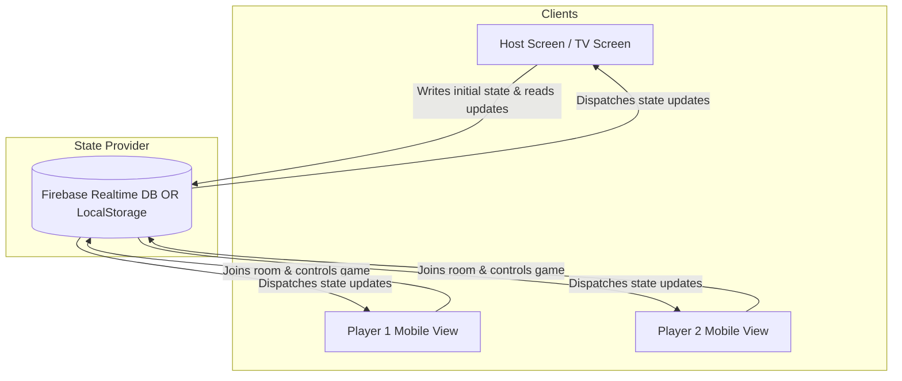
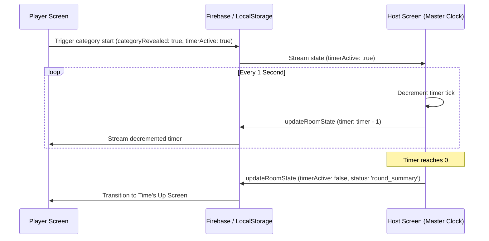

# Architecture

This document describes the design pattern, components, and real-time state synchronization mechanism of the **$25,000 Pyramid Game**.

---

## 1. System Topology

The game is designed as a **two-screen experience** synchronized via a shared database:

- **Host View (`HostScreen.jsx`)**: The "TV" screen showing the main game board, scoreboard, category selection status, and the countdown timer. The Host client acts as the authority for the game clock, updating the database every second when a timer is active.
- **Player View (`PlayerScreen.jsx`)**: The "Controller" view meant for smartphones or secondary browser tabs. Players join, get automatically assigned to Team 1 or Team 2, select categories (when it's their team's turn), read clues (clue giver role), and register correct answers or passes.

---

## 2. State Synchronization Layer (`firebase.js`)

Real-time coordination is handled in [firebase.js](file:///Users/jj/code/AI/pyramid-2026/src/firebase.js) through a set of abstraction helper functions. It supports two modes based on your credentials:

### A. Production Mode (Firebase Realtime Database)
When `firebaseConfig.apiKey` is supplied via environment variables:
- **`subscribeToRoom`**: Uses Firebase's `onValue()` reference subscription to stream the JSON tree matching the room code.
- **`updateRoomState`**: Uses Firebase's `update()` API, allowing selective deep path updates (e.g., updating `board/3/completed` or `teams/1/score` directly).
- **`setRoomState`**: Uses Firebase's `set()` API to overwrite the entire room data structure (used during initial lobby creation).

### B. Fallback Mode (LocalStorage Syncing)
If no Firebase API Key is provided, the application runs entirely locally using a simulated real-time connection across tabs/windows:
- **State Storage**: The room state is saved under a `room_{roomId}` key inside browser `localStorage`.
- **Inter-Tab Communication**:
  1. **Storage Events**: Listening to `window.addEventListener('storage', callback)` allows a tab to instantly receive state changes dispatched by *other* tabs.
  2. **Manual Dispatch**: Since the browser's `storage` event does not fire on the tab that initiated the write, `updateRoomState` and `setRoomState` manually trigger `window.dispatchEvent(new Event('storage'))` to keep the writer's state updated.
  3. **Polling Fallback**: A 1-second interval (`setInterval`) runs on subscriptions to guarantee updates are read even if storage events are delayed or fail to catch local actions.
- **Selective Deep Updates**: Because `localStorage` does not support path-based partial updates like Firebase, `updateRoomState` implements a parser to merge nested keys (like `players/user_123` or `wordStates/2`) into the main JSON blob before writing it back to storage.

---

## 3. Game Master Clock Flow

The Host Screen acts as the master authority for the timer state to prevent race conditions:

