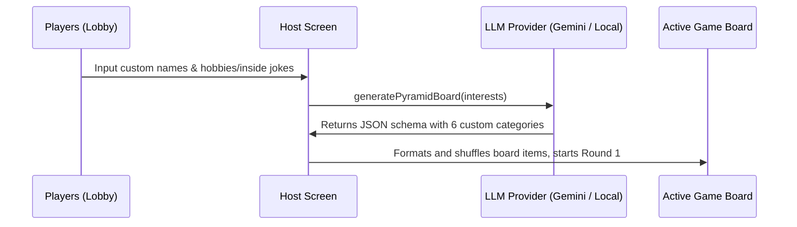

# Game Modes and AI Integration

This document outlines the game modes available in the **$25,000 Pyramid Game** and details how the AI Personalized Mode dynamically generates customized categories.

---

## 1. Classic Mode

In **Classic Mode**, the game reads pre-defined game configurations from a local static file: [data/content.json](file:///Users/jj/code/AI/pyramid-2026/data/content.json).

### Setup and Selection Logic
1. **Selecting a Round**: When the host starts the game, the server randomly picks one round object from the array in `content.json`.
2. **Category Extraction**: Each round defines a list of categories (typically 6). For each category:
   - The category name (`_name`) and clue description (`_description`) are fetched.
   - The array of associated words (`Word`) is shuffled using a random comparator (`0.5 - Math.random()`).
   - The first 6 words are sliced and assigned to the game board.
3. **Winner's Circle**: In Classic Mode, the Winner's Circle phrases are randomly selected from the `Circle/Phrase` array in the selected round config.

---

## 2. AI Personalized Mode

In **AI Personalized Mode**, the categories and words are generated on the fly tailored to player interests.



### The Generation Pipeline (`src/ai.js`)

When the host clicks **Start Game** in AI mode, the application extracts interest inputs from the players:
```javascript
const interests = players.map(p => p.interest).filter(Boolean);
const board = await generatePyramidBoard(interests);
```

This invokes `generatePyramidBoard` in [src/ai.js](file:///Users/jj/code/AI/pyramid-2026/src/ai.js), which queries the chosen LLM provider.

#### System Prompt Template
The AI is instructed to act as a content generator for the game, generating exactly 6 categories with exactly 7 words each:
```
You are a content generator for the game $25,000 Pyramid.
Your job is to generate exactly 6 categories, and each category must contain exactly 7 words.
The words must be things that fit the category perfectly.
Generate some categories tailored to the following player interests, and some general fun categories:
Interests: {playerInterests}

Output exactly this JSON format and absolutely nothing else:
[
  { 
    "name": "Category Name", 
    "description": "Category Description", 
    "words": ["Word1", "Word2", "Word3", "Word4", "Word5", "Word6", "Word7"] 
  },
  ...
]
```

#### Supported AI Providers

1. **Local Provider (`VITE_AI_PROVIDER="local"`)**:
   - Sends requests to a local instance of Ollama or LM Studio.
   - Supports automatic endpoint formatting: if the URL ends with `:11434` or `:1234`, it appends `/v1/chat/completions` automatically.
   - Requires setting the model parameter via `VITE_LOCAL_LLM_MODEL`.
2. **Gemini Provider (`VITE_AI_PROVIDER="gemini"`)**:
   - Queries the standard Google Generative Language REST endpoint (`gemini-1.5-flash-latest:generateContent`) directly using the `VITE_GEMINI_API_KEY`.

---

## 3. Robust JSON Parsing (`extractJsonFromText`)

To handle instances where models include conversational text, markdown code blocks (e.g. ` ```json `), or extra spacing, the parsing function `extractJsonFromText` applies fallback strategies:

- **First Try**: `JSON.parse(text)` directly.
- **Second Try**: Use regex to extract contents wrapped inside triple-backtick markdown blocks: `/```(?:json)?\s*([\s\S]*?)\s*```/i`.
- **Third Try**: Search for the index of the first `[` bracket and the last `]` bracket, extracting and parsing the substring between them.
- **Error Handling**: Throws an informative error if all attempts fail, and the Host screen falls back to Classic mode so the game can continue.
